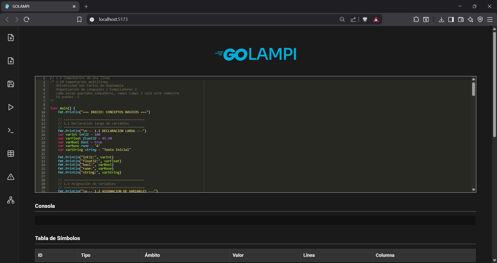
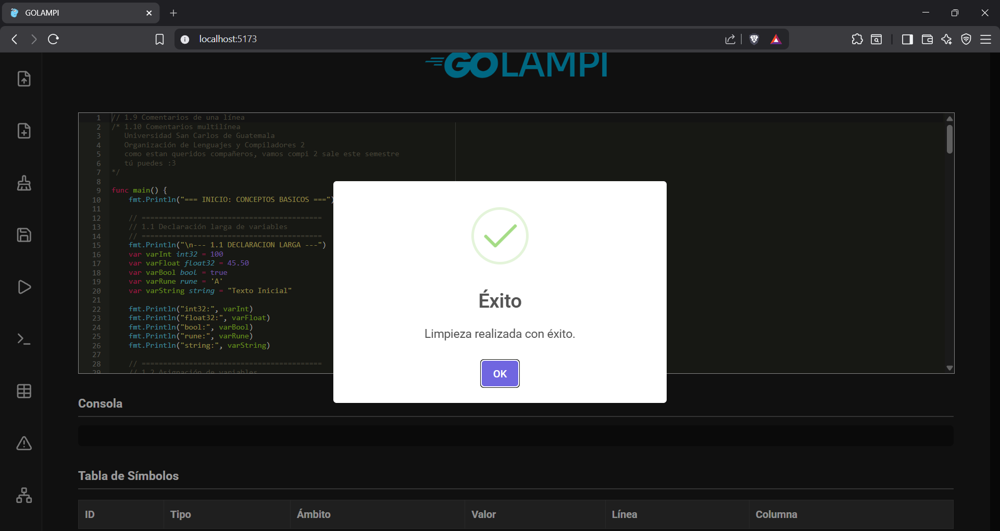
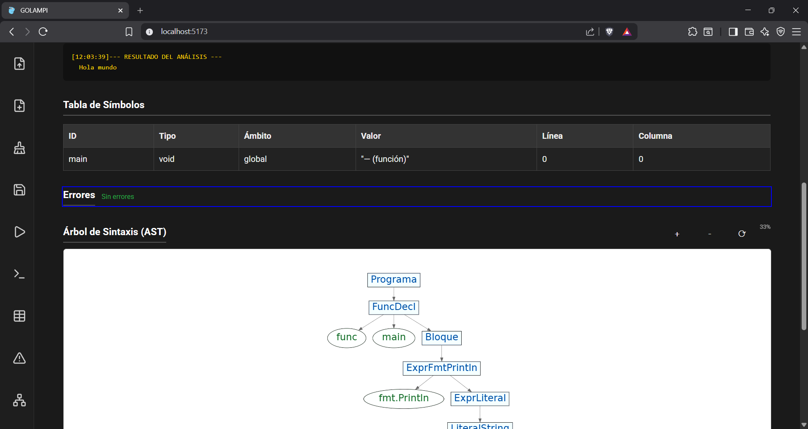
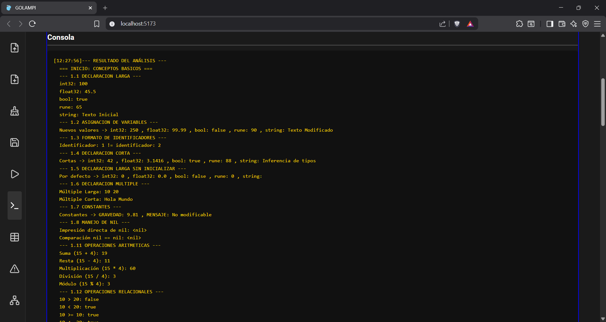
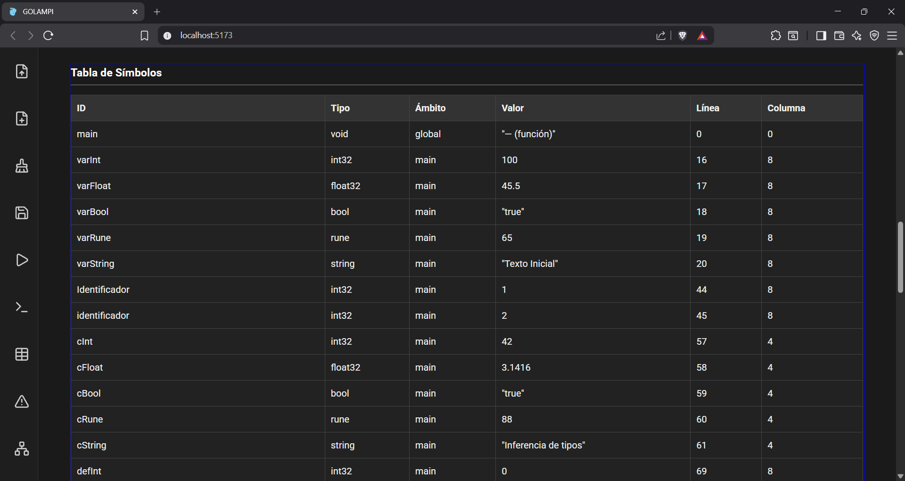
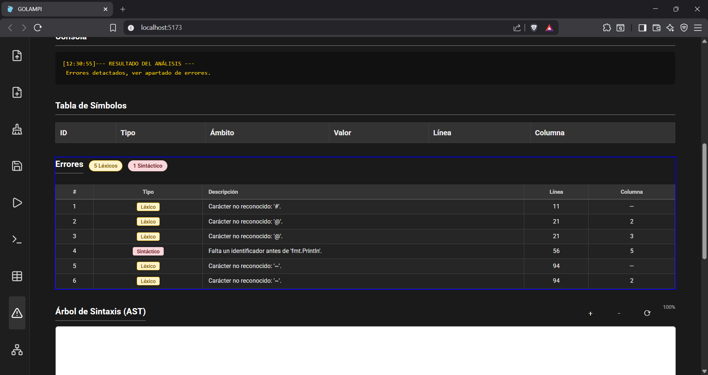

# MANUAL DE USUARIO

---

## Editor

Para poder inicializar el cliente, se requiere tener instalado `npm`, pues el cliente está desarrollado en ***Vite+React***.

### Instalación

Se agrega la serie de pasos a seguir para desplegar el frontend:

1. Se debe clonar el repositorio, con el comando:

~~~git
git clone https://github.com/DavidPaniagua5/OLC2_1S2026_P1_202004777
~~~

2. Se accede a la carpeta de cliente, con el comando:

~~~cmd
cd .\src\Client\
~~~

3. Una vez accedido a la carpeta de cliente, se descargan las dependendencias necesarias:

~~~cmd
npm install -y
~~~

Con este comando, se instalará la carpeta `node_modules`, la cuál contiene las librerías necesarias para desplegar la página web.

4. Se ejecuta el comando:

~~~cmd
npm run dev
~~~

Este comando levantará la página web, y le asignará un puerto del localhost para poder visualizar la misma. Se accede al enlace que se muestra en la consola.

5. Si se realizaron de forma correcta los pasos, se debe mostrar el editor de la siguiente manera:

### Funcionalidades

El editor de código tiene una variedad de funcionalidades, a las que se puede acceder a través de la sidebar ubicada a la izquiera del editor.

- **Abrir:** Esta es la primer funcionalidad de la sidebar, es un botón que al ser precionado abrirá una ventana para seleccionar un archivo a abrir en el ditor, al ser seleccionado el archivo correspondiente colocará el contenido dentro del apartado de editor de texto, para poder ver el mismo.

- **Nuevo:** Este botón permite al usuario crear un nuevo archivo, si existe código preguntará si se desean guardar los cambios. Acá debe seleccionar si se desean guardar o no.

- **Limpiar:** Este botón permmite al usuario limpiar la consola, la tabla de errores, la tabla de símbolos y el AST generado, es similar a Nuevo, a diferencia de que no limpia el editor de texto con el código actual.

- **Guardar:** Este botón permite al usuario guardar el contenido del editor de texto en un archivo `.go`. Al presionarlo se despliega un gestor de archivos para seleccionar el lugar en donde se desea descargar el archivo.
- **Ejecutar:** Este botón permite al ususario ejecutar el código escrito en el editor de texto. Genera la tabla de símbolos, la salida en consola y el AST, de existir errores los mostrará en el apartado correpondiente.

- **Consola:** Al precionar el botón se llevará a la consola, resaltandola para hacer más fácil su ubicación.

- **Tabla de símbolos:** Al precionar el botón se llevará a la tabla de símbolos, resaltandola para hacer más fácil su ubicación. Acá se muestran los símbolos encontrados durante el análisis, mostrando información relevante de los mismos.

- **Errores:** Al precionar el botón se llevará a la tabla de errores, resaltandola y mostrando los errores encontrados durante la ejecución, motrando información relevante para su ubicación y un resúmen de la cantidad encontrada de los mismos, según el tipo.

- **Árbol de sintáxis(AST):** Al precionar el botón se llevará a un área donde se muestra el árbol de sintáxis AST, acá se muestra un espacio donde se puede visualizar de manera intuitiva el ast, se le puede hacer zoom para poder ver de mejor manera la data del AST.

---

## Analizadores

Para poder levantar el servidor, se deben de tener ciertas dependencias, siguiendo las siguientes instrucciones.

1. El proyecto se trabaja en Debian12, por lo que el primer paso es ejecutar el siguiente comando en consola:

~~~cmd
sudo apt update && sudo apt upgrade -y
~~~

2. Se instalan las dependencias necesarias, tales como el lenguaje u otras dependencias para que la computadora puede ejecutar el código en `php`

~~~cmd
 sudo apt install php-cli php-mbstring php-xml unzip curl -y
~~~

3. Se descarga el composer, necesario para levantar el servidor, se utiliza el comando:

~~~cmd
curl -sS https://getcomposer.org/installer | php
~~~

4. Se instala java, necesario para ANTLR:

~~~cmd
sudo apt install default-jdk -y
~~~

5. Se instalan las librerias que necesita php en el proyecto, acá se debe verificar que estpe en el mismo nivel que `composer.json`:

~~~cmd
composer install
~~~

6. Se ejecuta antrl para tener los visitors necesarios para el análisis

~~~cmd
 antlr4 -Dlanguage=PHP Grammar.g4 -visitor -o ANTLRv4/
~~~

7. Con todo instalado, se levanta el servidor_

~~~cmd
php -S localhost:8000
~~~

---

## Ejemplo de Entradas

### Entrada válida

Este es un ejemplo de una posible entrada, el lenguaje es capaz de reconocer y ejecutar la siguiente entrada:

~~~go
func main() {
    fmt.Println("=== INICIO: CONCEPTOS BASICOS ===")

    // ==========================================
    // 1.1 Declaración larga de variables
    // ==========================================
    fmt.Println("\n--- 1.1 DECLARACION LARGA ---")
    var varInt int32 = 100
    var varFloat float32 = 45.50
    var varBool bool = true
    var varRune rune = 'A'
    var varString string = "Texto Inicial"
    
    fmt.Println("int32:", varInt)
    fmt.Println("float32:", varFloat)
    fmt.Println("bool:", varBool)
    fmt.Println("rune:", varRune)
    fmt.Println("string:", varString)

    // ==========================================
    // 1.2 Asignación de variables
    // ==========================================
    fmt.Println("\n--- 1.2 ASIGNACION DE VARIABLES ---")
    varInt = 250
    varFloat = 99.99
    varBool = false
    varRune = 'Z'
    varString = "Texto Modificado"
    
    fmt.Println("Nuevos valores -> int32:", varInt, ", float32:", varFloat, ", bool:", varBool, ", rune:", varRune, ", string:", varString)

    // ==========================================
    // 1.3 Formato de identificadores
    // ==========================================
    fmt.Println("\n--- 1.3 FORMATO DE IDENTIFICADORES ---")
    var Identificador int32 = 1  // Case sensitive: Mayúscula
    var identificador int32 = 2  // Case sensitive: Minúscula
    fmt.Println("Identificador:", Identificador, "!= identificador:", identificador)
    
    /* Descomentar para probar errores léxicos/sintácticos:
     
    ==========================================
    1.4 Declaración corta de variables
    ==========================================*/
    fmt.Println("\n--- 1.4 DECLARACION CORTA ---")
    cInt := 42
    cFloat := 3.1416
    cBool := true
    cRune := 'X'
    cString := "Inferencia de tipos"
    
    fmt.Println("Cortas -> int32:", cInt, ", float32:", cFloat, ", bool:", cBool, ", rune:", cRune, ", string:", cString)

    // ==========================================
    // 1.5 Declaración larga sin inicializar (Valores por defecto)
    // ==========================================
    fmt.Println("\n--- 1.5 DECLARACION LARGA SIN INICIALIZAR ---")
    var defInt int32
    var defFloat float32
    var defBool bool
    var defRune rune
    var defString string
    
    fmt.Println("Por defecto -> int32:", defInt, ", float32:", defFloat, ", bool:", defBool, ", rune:", defRune, ", string:", defString)

    // ==========================================
    // 1.6 Declaración múltiple de variables
    // ==========================================
    fmt.Println("\n--- 1.6 DECLARACION MULTIPLE ---")
    var mult1, mult2 int32 = 10, 20       // Larga
    mult3, mult4 := "Hola", "Mundo"       // Corta
    fmt.Println("Múltiple Larga:", mult1, mult2)
    fmt.Println("Múltiple Corta:", mult3, mult4)

    // ==========================================
    // 1.7 Declaración de constantes
    // ==========================================
    fmt.Println("\n--- 1.7 CONSTANTES ---")
    const GRAVEDAD float32 = 9.81
    const MENSAJE_CONST string = "No modificable"
    fmt.Println("Constantes -> GRAVEDAD:", GRAVEDAD, ", MENSAJE:", MENSAJE_CONST)
    // GRAVEDAD = 10.0 // Descomentar para probar error semántico

    // ==========================================
    // 1.8 Manejo de nil
    // ==========================================
    fmt.Println("\n--- 1.8 MANEJO DE NIL ---")
    // Cualquier operación con nil debería resultar en nil o manejarse sin botar el intérprete abruptamente
    fmt.Println("Impresión directa de nil:", nil)
    fmt.Println("Comparación nil == nil:", nil == nil)

    // ==========================================
    // 1.11 Operaciones Aritméticas
    // ==========================================
    fmt.Println("\n--- 1.11 OPERACIONES ARITMETICAS ---")
    a := 15
    b := 4
    fmt.Println("Suma (15 + 4):", a + b)
    fmt.Println("Resta (15 - 4):", a - b)
    fmt.Println("Multiplicación (15 * 4):", a * b)
    fmt.Println("División (15 / 4):", a / b)
    fmt.Println("Módulo (15 % 4):", a % b)

    // ==========================================
    // 1.12 Operaciones Relacionales
    // ==========================================
    fmt.Println("\n--- 1.12 OPERACIONES RELACIONALES ---")
    x := 10
    y := 20
    fmt.Println("10 > 20:", x > y)
    fmt.Println("10 < 20:", x < y)
    fmt.Println("10 >= 10:", x >= 10)
    fmt.Println("10 <= 20:", x <= y)
    fmt.Println("10 == 20:", x == y)
    fmt.Println("10 != 20:", x != y)

    // ==========================================
    // 1.13 Operaciones Lógicas
    // ==========================================
    fmt.Println("\n--- 1.13 OPERACIONES LOGICAS ---")
    t := true
    f := false
    fmt.Println("true && false:", t && f)
    fmt.Println("true || false:", t || f)
    fmt.Println("!true:", !t)

    // ==========================================
    // 1.14 Restricción de corto circuito
    // ==========================================
    fmt.Println("\n--- 1.14 RESTRICCION DE CORTO CIRCUITO ---")
    // Si no hay corto circuito, la división por 0 lanzará un error y detendrá el programa.
    // Con corto circuito, como el primer operando es false (en &&) o true (en ||), no evalúa lo demás.
    var divisionPorCeroIntencional int32 = 0
    cortoCircuitoAnd := false && (100 / divisionPorCeroIntencional == 1)
    cortoCircuitoOr  := true || (100 / divisionPorCeroIntencional == 1)
    
    fmt.Println("Corto circuito AND (debe ser false sin error):", cortoCircuitoAnd)
    fmt.Println("Corto circuito OR (debe ser true sin error):", cortoCircuitoOr)

    // ==========================================
    // 1.15 Operadores de asignación
    // ==========================================
    fmt.Println("\n--- 1.15 OPERADORES DE ASIGNACION ---")
    var asig int32 = 50
    fmt.Println("Valor base:", asig)
    asig += 10
    fmt.Println("+= 10:", asig)
    asig -= 20
    fmt.Println("-= 20:", asig)
    asig *= 2
    fmt.Println("*= 2:", asig)
    asig /= 4
    fmt.Println("/= 4:", asig)
    
    fmt.Println("\n=== FIN ===")
}

~~~

Salida esperada:

~~~cmd
 === INICIO: CONCEPTOS BASICOS ===
  --- 1.1 DECLARACION LARGA ---
  int32: 100
  float32: 45.5
  bool: true
  rune: 65
  string: Texto Inicial
  --- 1.2 ASIGNACION DE VARIABLES ---
  Nuevos valores -> int32: 250 , float32: 99.99 , bool: false , rune: 90 , string: Texto Modificado
  --- 1.3 FORMATO DE IDENTIFICADORES ---
  Identificador: 1 != identificador: 2
  --- 1.4 DECLARACION CORTA ---
  Cortas -> int32: 42 , float32: 3.1416 , bool: true , rune: 88 , string: Inferencia de tipos
  --- 1.5 DECLARACION LARGA SIN INICIALIZAR ---
  Por defecto -> int32: 0 , float32: 0.0 , bool: false , rune: 0 , string: 
  --- 1.6 DECLARACION MULTIPLE ---
  Múltiple Larga: 10 20
  Múltiple Corta: Hola Mundo
  --- 1.7 CONSTANTES ---
  Constantes -> GRAVEDAD: 9.81 , MENSAJE: No modificable
  --- 1.8 MANEJO DE NIL ---
  Impresión directa de nil: <nil>
  Comparación nil == nil: <nil>
  --- 1.11 OPERACIONES ARITMETICAS ---
  Suma (15 + 4): 19
  Resta (15 - 4): 11
  Multiplicación (15 * 4): 60
  División (15 / 4): 3
  Módulo (15 % 4): 3
  --- 1.12 OPERACIONES RELACIONALES ---
  10 > 20: false
  10 < 20: true
  10 >= 10: true
  10 <= 20: true
  10 == 20: false
  10 != 20: true
  --- 1.13 OPERACIONES LOGICAS ---
  true && false: false
  true || false: true
  !true: false
  --- 1.14 RESTRICCION DE CORTO CIRCUITO ---
  Corto circuito AND (debe ser false sin error): false
  Corto circuito OR (debe ser true sin error): true
  --- 1.15 OPERADORES DE ASIGNACION ---
  Valor base: 50
  += 10: 60
  -= 20: 40
  *= 2: 80
  /= 4: 20
  === FIN ===
~~~

### Entrada con errores

Esta entrada contiene errores léxicos:

~~~cmd
func main(){
    
    x := 32?
    
    # 
    
    y := 55$
    
    $   
}
~~~

La salida de errores, devería ser

