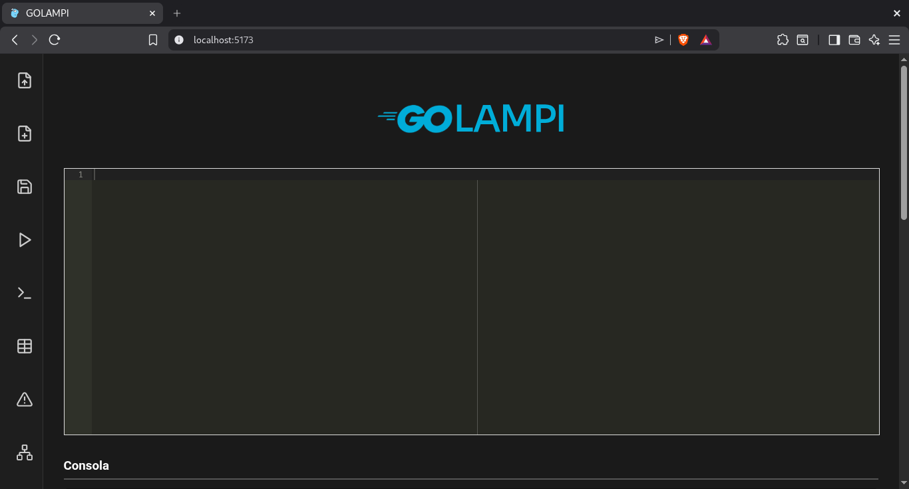
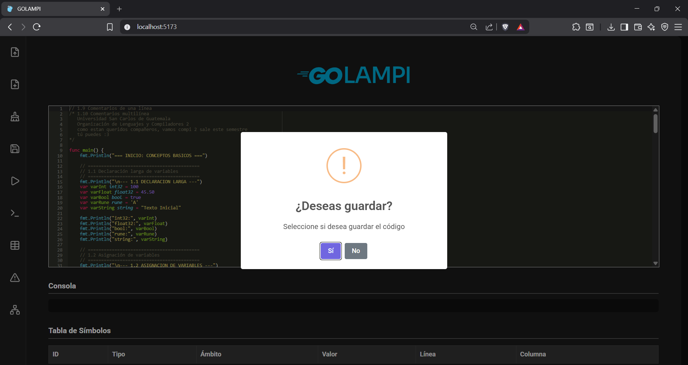
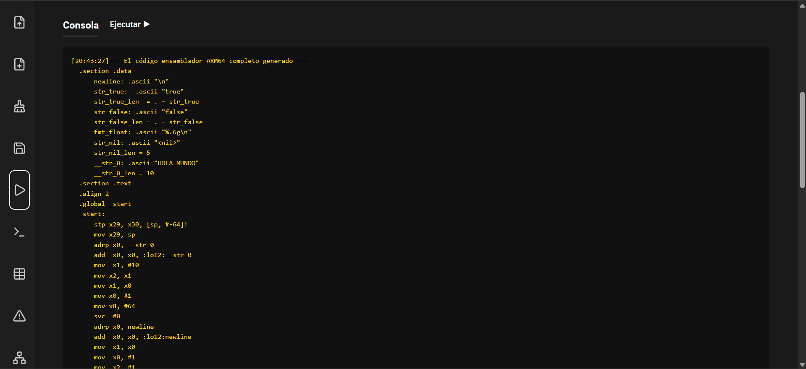
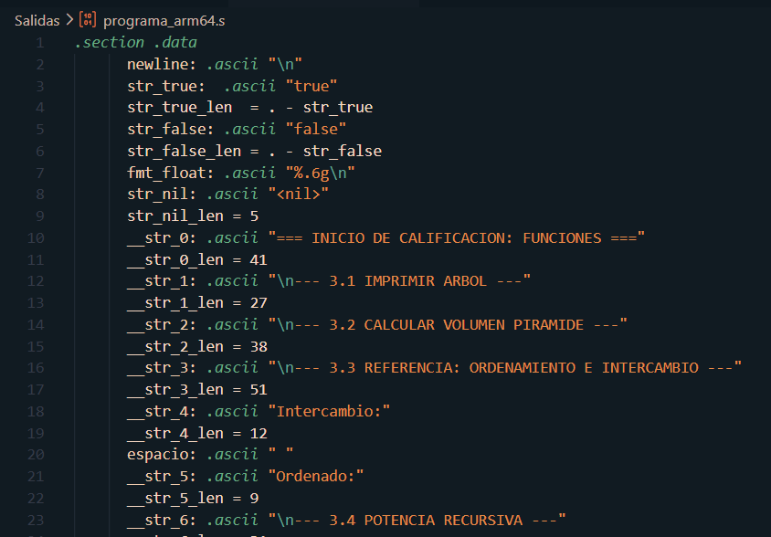
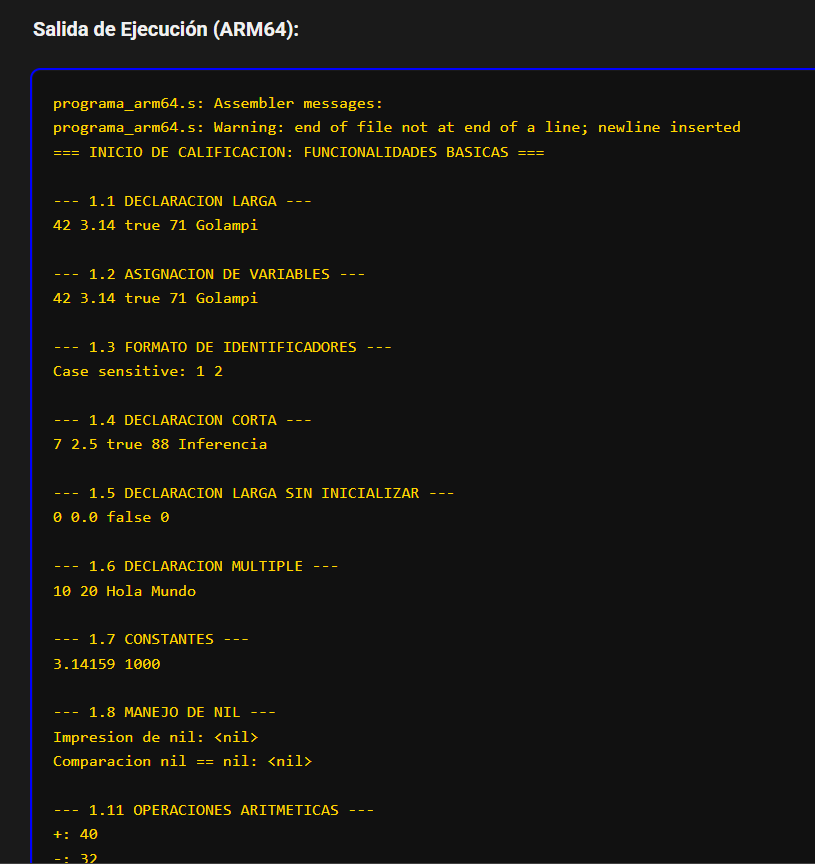
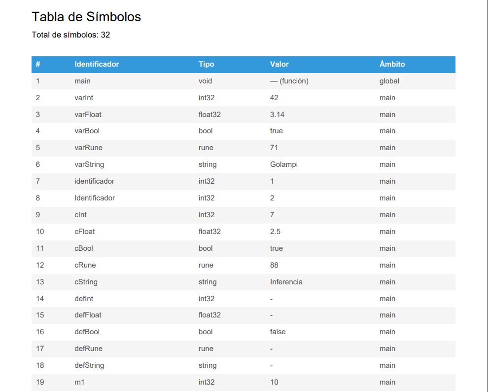
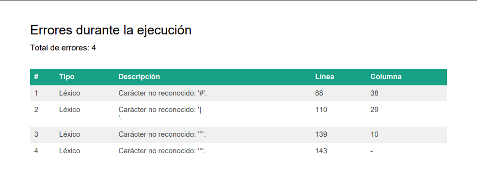
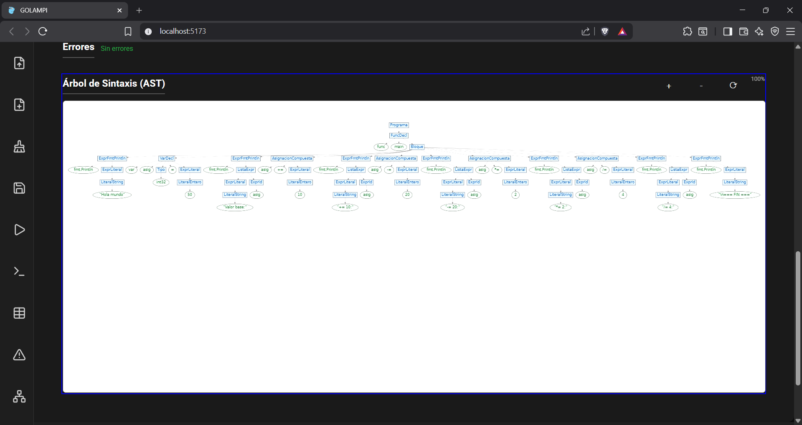
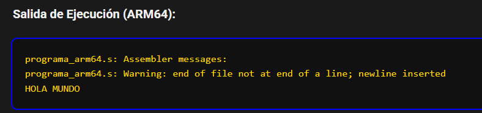
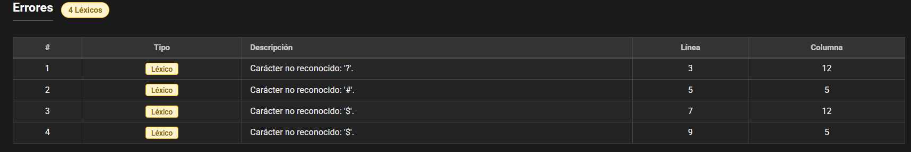

# MANUAL DE USUARIO

---

## Editor

Para poder inicializar el cliente, se requiere tener instalado `npm`, pues el cliente está desarrollado en ***Vite+React***.

### Instalación

Se agrega la serie de pasos a seguir para desplegar el frontend:

1. Se debe clonar el repositorio, con el comando:

~~~git
git clone https://github.com/DavidPaniagua5/OLC2_1S2026_P1_202004777
~~~

2. Se accede a la carpeta de cliente, con el comando:

~~~cmd
cd .\src\Client\
~~~

3. Una vez accedido a la carpeta de cliente, se descargan las dependendencias necesarias:

~~~cmd
npm install -y
~~~

Con este comando, se instalará la carpeta `node_modules`, la cuál contiene las librerías necesarias para desplegar la página web.

4. Se ejecuta el comando:

~~~cmd
npm run dev
~~~

Este comando levantará la página web, y le asignará un puerto del localhost para poder visualizar la misma. Se accede al enlace que se muestra en la consola.

5. Si se realizaron de forma correcta los pasos, se debe mostrar el editor de la siguiente manera:

### Funcionalidades

El editor de código tiene una variedad de funcionalidades, a las que se puede acceder a través de la sidebar ubicada a la izquiera del editor.

- **Abrir:** Esta es la primer funcionalidad de la sidebar, es un botón que al ser precionado abrirá una ventana para seleccionar un archivo a abrir en el ditor, al ser seleccionado el archivo correspondiente colocará el contenido dentro del apartado de editor de texto, para poder ver el mismo.

- **Nuevo:** Este botón permite al usuario crear un nuevo archivo, si existe código preguntará si se desean guardar los cambios. Acá debe seleccionar si se desean guardar o no.

- **Limpiar:** Este botón permmite al usuario limpiar la consola, la tabla de errores, la tabla de símbolos y el AST generado, es similar a Nuevo, a diferencia de que no limpia el editor de texto con el código actual.

- **Guardar:** Este botón permite al usuario guardar el contenido del editor de texto en un archivo `.go`. Al presionarlo se despliega un gestor de archivos para seleccionar el lugar en donde se desea descargar el archivo.
- **Ejecutar:** Este botón permite al ususario ejecutar el código escrito en el editor de texto. Genera la tabla de símbolos, la salida en consola y el AST, de existir errores los mostrará en el apartado correpondiente. Además coloca el código ARM64 en la consola, acá se adunta un nuevo botón, el cual es `Ejecutar ►`, esto automatiza la ejecución del código `ARM64`

- **Consola:** Al precionar el botón se podrá descargar el código `ARM64` generado, para poder ser ejecutado en cualquier sistema que lo permita.

- **Ejecutar ►:** Este botón permite ejecutar el código `ARM64` generado por el compilador, es capaz de realizar la solicitud al servidor, para poder ser ejecutado en un sistema Linux y devuelve la salida del código.

- **Tabla de símbolos:** Al precionar el botón se descargará el reporte, en formato pdf, de la tabla de símbolos del texto ingresado, en caso de generar un archivo con errores, no se mostrará nada en el reporte generado.

- **Errores:** Al precionar el botón se llevará a la tabla de errores, el cuál es un reporte generado en formato pdf, el cual puede ser descargado, será un resúmen de las errores encontrados durante la ejecución, incluyenfo información útil para la solución de los mismos.

- **Árbol de sintáxis(AST):** Al precionar el botón se llevará a un área donde se muestra el árbol de sintáxis AST, acá se muestra un espacio donde se puede visualizar de manera intuitiva el ast, se le puede hacer zoom para poder ver de mejor manera la data del AST.

---

## Analizadores

Para poder levantar el servidor, se deben de tener ciertas dependencias, siguiendo las siguientes instrucciones.

1. El proyecto se trabaja en Debian12, por lo que el primer paso es ejecutar el siguiente comando en consola:

~~~cmd
sudo apt update && sudo apt upgrade -y
~~~

2. Se instalan las dependencias necesarias, tales como el lenguaje u otras dependencias para que la computadora puede ejecutar el código en `php`

~~~cmd
 sudo apt install php-cli php-mbstring php-xml unzip curl -y
~~~

3. Se descarga el composer, necesario para levantar el servidor, se utiliza el comando:

~~~cmd
curl -sS https://getcomposer.org/installer | php
~~~

4. Se instala java, necesario para ANTLR:

~~~cmd
sudo apt install default-jdk -y
~~~

5. Se instalan las librerias que necesita php en el proyecto, acá se debe verificar que estpe en el mismo nivel que `composer.json`:

~~~cmd
composer install
~~~

6. Se ejecuta antrl para tener los visitors necesarios para el análisis

~~~cmd
 antlr4 -Dlanguage=PHP Grammar.g4 -visitor -o ANTLRv4/
~~~

7. Con todo instalado, se levanta el servidor_

~~~cmd
php -S localhost:8000
~~~

8. Para poder ejecutar código `ARM64` es necesario tener un sistema que soporte la arquitectura, para ello se utiliza `QEMU`, el cuál se descarga por medio de la terminal, utilizando el comando:

~~~sh
sudo apt install qemu qemu-user qemu-user-static -y
~~~

Validando la instalación con:

~~~sh
qemu-aarch64 --version
~~~

9. Se debe instalar el compilador para ARM64

~~~sh
sudo apt install gcc-aarch64-linux-gnu -y
~~~

10. Para la ejecución del código generado, se debe seguir el siguiente orden:
    1.  Ejecutar la conversión de `ARM64` a `Binario`:

    ~~~sh
    aarch64-linux-gnu-as programa_arm64.s -o programa_arm64.o
    ~~~

    2.  Compilar el binario a un ejecutable

    ~~~sh
    aarch64-linux-gnu-ld programa_arm64.o -o programa_arm64
    ~~~

    3.  Ejecutar el archivo compilado para mostar la salida

    ~~~sh
    qemu-aarch64 .\programa_arm64
    ~~~

---

## Ejemplo de Entradas

### Entrada válida

Este es un ejemplo de una posible entrada, el lenguaje es capaz de reconocer y ejecutar la siguiente entrada:

~~~go
func main (){
    fmt.Println("HOLA MUNDO")
}
~~~

Salida esperada:

~~~cmd
 .section .data
      newline: .ascii "\n"
      str_true:  .ascii "true"
      str_true_len  = . - str_true
      str_false: .ascii "false"
      str_false_len = . - str_false
      fmt_float: .ascii "%.6g\n"
      str_nil: .ascii "<nil>"
      str_nil_len = 5
      __str_0: .ascii "HOLA MUNDO"
      __str_0_len = 10
  .section .text
  .align 2
  .global _start
  _start:
      stp x29, x30, [sp, #-64]!
      mov x29, sp
      adrp x0, __str_0
      add  x0, x0, :lo12:__str_0
      mov  x1, #10
      mov x2, x1
      mov x1, x0
      mov x0, #1
      mov x8, #64
      svc  #0
      adrp x0, newline
      add  x0, x0, :lo12:newline
      mov  x1, x0
      mov  x0, #1
      mov  x2, #1
      mov  x8, #64
      svc  #0
      ldp x29, x30, [sp], #64
      mov x0, #0
      mov x8, #93
      svc #0
  __print_int:
      stp x29, x30, [sp, #-80]!
      mov x29, sp
      mov x19, x0
      mov x20, #0
      mov x21, #10
      cmp x19, #0
      b.ge __pi_positivo
      mov x22, #45
      sub sp, sp, #16
      strb w22, [sp]
      mov x0, #1
      mov x1, sp
      mov x2, #1
      mov x8, #64
      svc #0
      add sp, sp, #16
      neg x19, x19
  __pi_positivo:
      add x22, x29, #16
  __pi_loop:
      udiv x23, x19, x21
      msub x24, x23, x21, x19
      add  x24, x24, #48
      strb w24, [x22, x20]
      add  x20, x20, #1
      mov  x19, x23
      cbnz x19, __pi_loop
      mov x23, #0
      sub x24, x20, #1
  __pi_rev:
      cmp x23, x24
      b.ge __pi_write
      ldrb w25, [x22, x23]
      ldrb w26, [x22, x24]
      strb w25, [x22, x24]
      strb w26, [x22, x23]
      add  x23, x23, #1
      sub  x24, x24, #1
      b    __pi_rev
  __pi_write:
      mov x0, #1
      mov x1, x22
      mov x2, x20
      mov x8, #64
      svc #0
      ldp x29, x30, [sp], #80
      ret
~~~

Salida al ejecutar el `ARM64`

### Entrada con errores

Esta entrada contiene errores léxicos:

~~~cmd
func main(){
    
    x := 32?
    
    # 
    
    y := 55$
    
    $   
}
~~~

La salida de errores, devería ser

